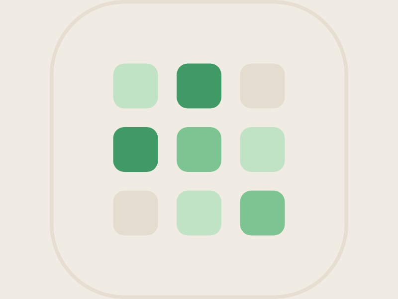

<p align="center">
  
</p>

<h1 align="center">导了吗 · daolema</h1>

<p align="center">
  
  
  
</p>

一个**私密、克制、中性**的个人状态记录与统计 App（Flutter，iOS / Android / macOS / Windows / Linux）。
用 GitHub 风格年度热力图、趋势统计、标签分析与目标管理，帮你安静地观察自己的节奏与习惯——不评判、不说教。

## 功能

底部导航四页 + 多个覆盖层：

- **首页**：今天记录了吗？· 今日/本周/本月次数 · 距上次 · 一键「记录一次」· 本周目标进度 · 年度热力图（53 周横向滚动）· 最近一次记录
- **日历**：月历翻月 · 每日次数色点 · 选中日详情（编辑/删除/补录）
- **统计**：7/30/90/今年区间 · 6 项总览 · 趋势折线 · 星期分布 · 时间段分布 · 标签排行 · 间隔统计
- **设置**：外观浅/深切换 · 主色调四色 · App 锁 / Face ID / 伪装模式 / 模糊通知 · 立即锁定 · 标签管理 · 导出 CSV/JSON · 导入 · 加密备份 · 目标设置 · 清空数据
- **记录弹窗**：日期/时间/次数 · 标签多选 · 心情&压力 1–5 · 备注
- **隐私锁**：6 位密码点阵 + 数字键盘 + Face ID
- **伪装模式**：开启后名称→「习惯记录」、首页→「今天状态如何？」、通知文案同步切换

主题：**浅色（暖纸张）/ 深色（暖墨）** 双主题 + **森绿 / 墨蓝 / 藕紫 / 琥珀** 四套主色调（连热力图同步换色）。
标题与数字用 Noto Serif SC（思源宋体），正文用系统字体。

## 技术栈

- **Flutter**（iOS / Android / macOS / Windows / Linux 五平台发布，附带实验性 Web 目标）
- 状态管理：`provider` + `ChangeNotifier`（`AppController`）
- 本地持久化：**drift（SQLite）** 存记录 · `shared_preferences` 存设置/目标/标签 · `flutter_secure_storage` 存锁屏 PIN（本地优先，数据不出本机）
- 矢量图标：`flutter_svg`（沿用原型 SVG path）

## 运行

```bash
flutter pub get
dart run build_runner build      # 生成 drift 代码（已提交，改表结构后重跑）
flutter run                      # 选择手机、桌面或模拟器设备
```

- **iOS / Android / macOS / Windows**：安装对应平台的 Flutter 原生工具链后可直接运行。
- **Linux**：构建前需安装 GTK、CMake、Ninja、pkg-config 与 libsecret 开发包；导出文件时使用系统保存对话框。
- **Web**：drift 在 web 上需要 `sqlite3.wasm` 与 `drift_worker.js` 放入 `web/` 目录后才能持久化，默认未附带。

## 目录结构

```
lib/
  main.dart                  入口：初始化 DB/prefs、首跑写入演示数据、注入 Provider
  app.dart                   MaterialApp + RootShell（Stack 组装页面/覆盖层/锁屏/Toast）
  theme/                     palette(双主题+四主色派生) · app_theme(字体)
  data/
    db/                      drift Records 表
    models/                  RecordEntry · Goals · AppSettings
    repositories/            记录仓库(drift) · 设置仓库(prefs+secure，PIN 加盐哈希)
    seed/                    mulberry32 演示数据生成
    backup_service.dart      CSV/JSON 编解码 · AES-GCM+PBKDF2 加密（纯逻辑，可单测）
    share_service.dart       移动/Apple/Windows 分享面板 · Linux 保存文件
    file_pick_service.dart   选择导入文件(file_selector)
    auth_service.dart        生物识别(local_auth)
  state/app_controller.dart  全局状态 + 行为 + 持久化（移植自原型 renderVals）
  util/                      日期 · 统计/热力图纯函数 · SVG 图标 · pin_crypto
  widgets/                   iOS 开关/分组卡/分段切换/进度条/logo/底部导航/Toast/pin_pad
  features/                  home / calendar / stats / settings / record / overlays / lock
test/                        纯逻辑单测（算法/调色板 · CSV/JSON/加密/PIN 往返）
linux/packaging/             AppImage / DEB 打包脚本与桌面入口
windows/packaging/           Inno Setup 安装器配置
.github/workflows/           五平台正式版 · Nightly pre-release
```

## 数据与隐私

- 数据**仅保存在本机**（SQLite + 本地 key-value）。
- 首次启动写入约一年的种子演示数据（基于固定随机种子，可复现）；可在设置页「清空全部数据」清除。
- **锁屏（真实）**：6 位数字 PIN，仅以「随机盐 + SHA-256 哈希」存入 `flutter_secure_storage`（PIN 本身不落盘），解锁时校验、错误抖动提示。开启 App 锁时引导设置密码，设置页可「修改密码」。
- **生物识别（真实）**：通过 `local_auth` 调系统 Face ID / 指纹；开启前检测设备支持，锁屏提供「使用 Face ID」。
- **导出（真实）**：导出 CSV（仅记录）或 JSON（记录 + 设置 + 目标 + 标签）；Linux 保存到用户选择的位置，其余平台经系统分享面板交付。
- **加密备份（真实）**：口令派生密钥（PBKDF2-HMAC-SHA256）+ AES-GCM 加密为 JSON 信封后保存或分享。
- **导入（真实）**：选择文件后自动识别「加密信封 / JSON / CSV」（加密的先要口令解密），再询问「合并（按 id 去重）」或「覆盖（清空后导入）」。

> 平台说明：`local_auth` 在 Android、iOS、macOS、Windows 上按设备能力工作；Linux 会提示不支持生物识别。
